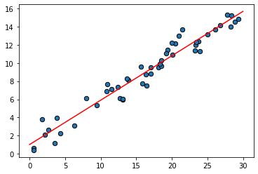
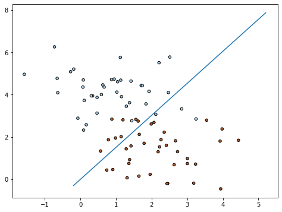
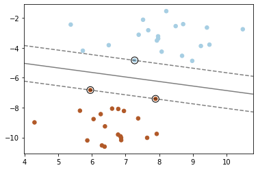
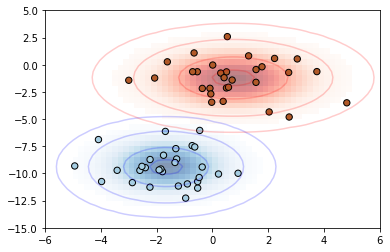
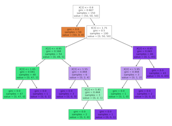
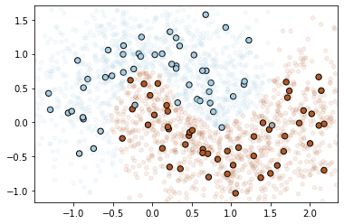

# PyML

A minimalistic implementation of common machine learning algorithms.

## Overview

### Supervised Learning

[**Linear Regression**](#linear-regression) | [**Logistic Regression**](#logistic-regression) | [**SVM**](#svm)
:---: | :---: | :---:
 |  |  
[**Naive Bayes**](#naive-bayes) | [**CART**](#cart) | [**k-NN**](#k-NN)
  |  |  

## Usage

### Linear Regression

`class LinearRegression(lr=1e-3, tol=1e-4, verbose=False)` [\[source\]](lib/linear_regression.py)

#### Simple Linear Regression

[Full Example](examples/linear_regression_simple.ipynb)

```python
import numpy as np

from lib.linear_regression import LinearRegression

X = 30 * np.random.random((50, 1))
y = 0.5 * X + 1.0 + np.random.normal(size=X.shape)

model = LinearRegression(verbose=True)
model.fit(X, y)

X_new = np.linspace(0, 30, 100)
y_new = model.predict(X_new[:, np.newaxis])
```

#### Multiple Linear Regression

[Full Example](examples/linear_regression_multiple.ipynb)

```python
import numpy as np

from lib.linear_regression import LinearRegression

rng = np.random.RandomState(1)

X = rng.randn(200, 2)
y = np.dot(X, [-2, 1]) + 0.1 * rng.randn(X.shape[0])

model = LinearRegression(verbose=True)
model.fit(X, y)

X_new = rng.randn(100, 2)
y_new = model.predict(X_new)
```

### Logistic Regression

`class LogisticRegression(weights=None, lr=1e-3, verbose=False)` [\[source\]](lib/logistic_regression.py)

[Full Example](examples/logistic_regression.ipynb)

```python
from sklearn.datasets import make_blobs

from lib.logistic_regression import LogisticRegression

X, y = make_blobs(n_samples=80, centers=2, random_state=0)

model = LogisticRegression(lr=1e-2, verbose=True)
model.fit(X, y)

y_pred = model.predict(X)
```

### SVM

`class PegasosSVM(kernel='rbf', degree=3, gamma=1, coef0=0.0, lambda_=1, max_iter=10)` [\[source\]](lib/pegasos.py)

Note: This implements [PEGASOS: Primal Estimated sub-GrAdient SOlver for SVM](https://ttic.uchicago.edu/~nati/Publications/PegasosMPB.pdf) instead of the standard SVM.

#### Linear Separable

[Full Example](examples/svm_linear.ipynb)

```python
from sklearn.datasets import make_blobs

from lib.pegasos import PegasosSVM

X, y = make_blobs(n_samples=40, centers=2, random_state=6)
y = np.where(y > 0, 1, -1)

model = PegasosSVM(kernel='linear', max_iter=100)
model.fit(X, y)

y_pred = model.predict(X)
```

#### Non-linear Separable

[Full Example](examples/svm_nonlinear.ipynb)

```python
from sklearn.datasets import make_circles

from lib.pegasos import PegasosSVM

X, y = make_circles(noise=0.2, factor=0.5, random_state=1)
y = np.where(y > 0, 1, -1)

model = PegasosSVM(kernel='rbf', max_iter=100)
model.fit(X, y)

y_pred = model.predict(X)
```

### Naive Bayes

`class NaiveBayes()` [\[source\]](lib/naive_bayes.py)

[Full Example](examples/naive_bayes.ipynb)

```python
from sklearn.datasets import make_blobs

from lib.naive_bayes import NaiveBayes

X, y = make_blobs(n_samples=60, centers=2, random_state=2, cluster_std=1.5)

model = NaiveBayes()
model.fit(X, y)

y_pred = model.predict(X)
```

### CART

`class DecisionTreeClassifier(max_depth=None)` [\[source\]](lib/cart.py)

[Full Example](examples/cart.ipynb)

```python
from sklearn.datasets import load_iris

from lib.cart import DecisionTreeClassifier

X, y = load_iris(return_X_y=True)

model = DecisionTreeClassifier()
model.fit(X, y)
y_pred = model.predict(X)
```

### k-NN

`class KNeighborsClassifier(k=1)` [\[source\]](lib/knn.py)

[Full Example](examples/knn.ipynb)

```python
from sklearn.datasets import make_moons

from lib.knn import KNeighborsClassifier

X, y = make_moons(noise=0.3, random_state=0)
X_train, X_test, y_train, y_test = train_test_split(X, y, test_size=0.2, random_state=0)

model = KNeighborsClassifier(k=3)
y_pred = model.predict(X_train, y_train, X_test)
```

## References

- [fast.ai Wiki](http://wiki.fast.ai/index.php/Main_Page)
- [Implementing Naive Bayes in 2 minutes with Python](https://towardsdatascience.com/implementing-naive-bayes-in-2-minutes-with-python-3ecd788803fe)
- [Decision Tree from Scratch in Python](https://towardsdatascience.com/decision-tree-from-scratch-in-python-46e99dfea775)
- [Develop k-Nearest Neighbors in Python From Scratch](https://machinelearningmastery.com/tutorial-to-implement-k-nearest-neighbors-in-python-from-scratch/)
- [Implementing PEGASOS: Primal Estimated sub-GrAdient SOlver for SVM, Logistic Regression and Application in Sentiment Classification (in Python)](https://sandipanweb.wordpress.com/2018/04/29/implementing-pegasos-primal-estimated-sub-gradient-solver-for-svm-using-it-for-sentiment-classification-and-switching-to-logistic-regression-objective-by-changing-the-loss-function-in-python/)