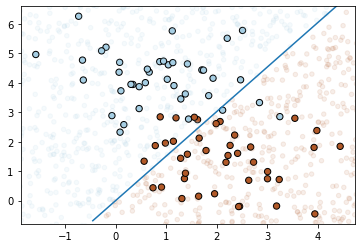

# PyML

A minimalistic implementation of common machine learning algorithms.

## Overview

[**Linear Regression**](#linear-regression) | [**Logistic Regression**](#logistic-regression)
:---: | :---:
 |  
[**Naive Bayes**](#naive-bayes) | [**k-NN**](#k-NN)
  | 

## Usage

### Linear Regression

[Full Example](examples/linear_regression.ipynb)

```python
import numpy as np

from lib.linear_regression import LinearRegression

X = 30 * np.random.random((50, 1))
y = 0.5 * X + 1.0 + np.random.normal(size=X.shape)

model = LinearRegression(verbose=True)
model.fit(X, y)

X_new = np.linspace(0, 30, 100)
y_new = model.predict(X_new[:, np.newaxis])
```

### Logistic Regression

[Full Example](examples/logistic_regression.ipynb)

```python
from sklearn.datasets import make_blobs

from lib.logistic_regression import LogisticRegression

X, y = make_blobs(n_samples=80, centers=2, random_state=0)

model = LogisticRegression(verbose=True)
model.fit(X, y)

y_pred = model.predict(X)
```

### Naive Bayes

[Full Example](examples/naive_bayes.ipynb)

```python
from sklearn.datasets import make_blobs

from lib.naive_bayes import NaiveBayes

X, y = make_blobs(n_samples=60, centers=2, random_state=2, cluster_std=1.5)

model = NaiveBayes()
model.fit(X, y)

y_pred = model.predict(X)
```

### k-NN
[Full Example](examples/knn.ipynb)

```python
from sklearn.datasets import make_moons

from lib.knn import KNeighborsClassifier

X, y = make_moons(noise=0.3, random_state=0)
X_train, X_test, y_train, y_test = train_test_split(X, y, test_size=0.2, random_state=0)

model = KNeighborsClassifier(k=3)
y_pred = model.predict(X_train, y_train, X_test)
```

## References

- [fast.ai Wiki](http://wiki.fast.ai/index.php/Main_Page)
- [Implementing Naive Bayes in 2 minutes with Python](https://towardsdatascience.com/implementing-naive-bayes-in-2-minutes-with-python-3ecd788803fe)
- [Develop k-Nearest Neighbors in Python From Scratch](https://machinelearningmastery.com/tutorial-to-implement-k-nearest-neighbors-in-python-from-scratch/)
